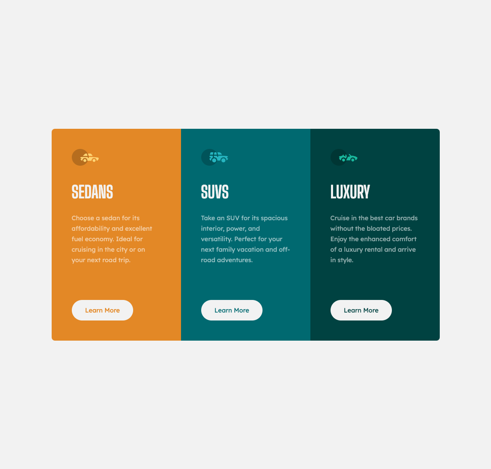

# Frontend Mentor - 3-column preview card component solution

This is a solution to the [3-column preview card component challenge on Frontend Mentor](https://www.frontendmentor.io/challenges/3column-preview-card-component-pH92eAR2-). Frontend Mentor challenges help you improve your coding skills by building realistic projects.

## Overview

### The challenge

Users should be able to:

- View the optimal layout depending on their device's screen size
- See hover states for interactive elements

### Screenshot

### Links

- Solution URL: [Add solution URL here](https://github.com/darpots/fm-3col-preview-card)
- Live Site URL: [Add live site URL here](https://fm-3col-preview-card.vercel.app)

## My process

### Built with

- Svelte

## Author

- Website - [Add your name here](https://www.darpots.dev)
- Frontend Mentor - [@darpots](https://www.frontendmentor.io/profile/darpots)
- Twitter - [@darpots](https://www.twitter.com/darpots)
